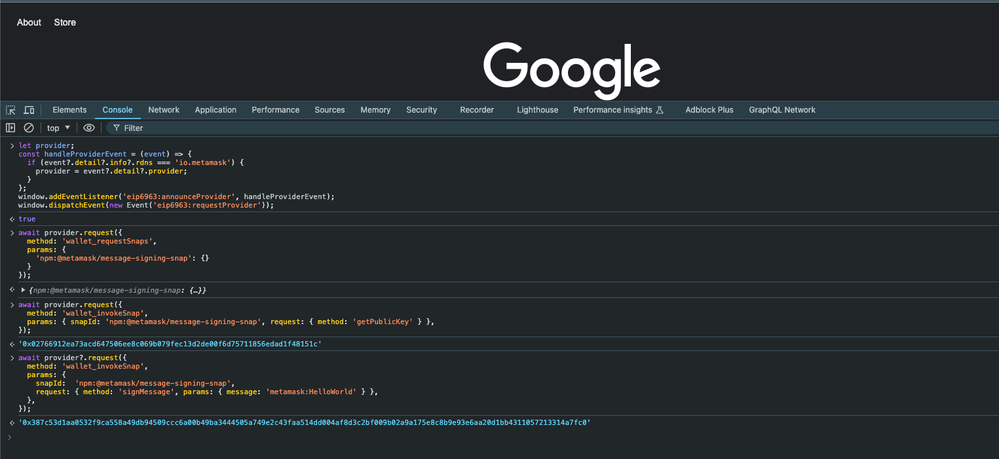

# Testing Snap

## Testing Snap on Main Wallet

This snap is a pre-installed snap on MetaMask, so can be tested on the main wallet via the following RPC calls.
All commands below can be called via the developer console in your browser.

<details>

  <summary>See screenshot of wallet calls in browser dev tools</summary>



</details>

### Pre-requisite - fetching provider

You can use EIP-6963 to fetch the metamask provider.

```js
let provider;
const handleProviderEvent = (event) => {
  if (event?.detail?.info?.rdns === 'io.metamask') {
    provider = event?.detail?.provider;
  }
};
window.addEventListener('eip6963:announceProvider', handleProviderEvent);
window.dispatchEvent(new Event('eip6963:requestProvider'));
```

### Snap Method - Connecting Snap

To then use the snap, you can connect the site that wishes to use the snap.

```js
await provider.request({
  method: 'wallet_requestSnaps',
  params: {
    'npm:@metamask/message-signing-snap': {},
  },
});
```

### Snap Method - Get Public Key

You can invoke this method once the snap is connected

```js
await provider.request({
  method: 'wallet_invokeSnap',
  params: {
    snapId: 'npm:@metamask/message-signing-snap',
    request: { method: 'getPublicKey' },
  },
});
```

### Snap Method - Sign Message

You can invoke this method once the snap is connected

```js
await provider.request({
  method: 'wallet_invokeSnap',
  params: {
    snapId: 'npm:@metamask/message-signing-snap',
    request: {
      method: 'signMessage',
      params: { message: 'metamask:HelloWorld' },
    },
  },
});
```
